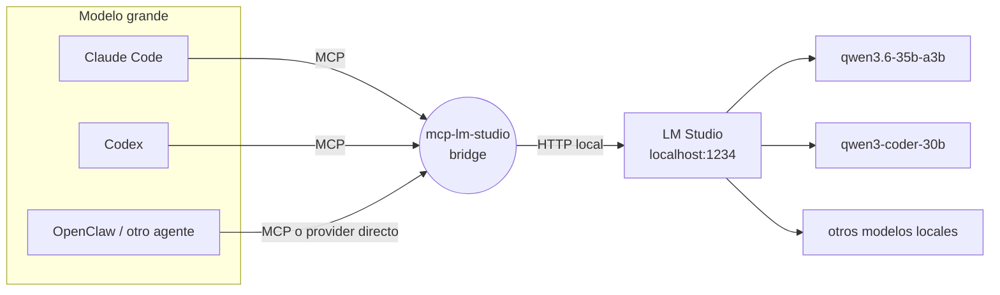

# llm-Intern

[](LICENSE)
[](package.json)
[](https://modelcontextprotocol.io/)


Servidor MCP que expone un modelo local de [LM Studio](https://lmstudio.ai/) como
tools de **Claude Code**, **Codex** y **OpenClaw** (u otro framework de agentes
local) — "el intern": delegación de trabajo mecánico o masivo a un modelo que corre
gratis en tu propia máquina, para no gastar cuota del modelo grande en tareas que no
la necesitan.

No es un reemplazo del modelo grande. Es un ayudante barato para lo mecánico, con
reglas claras de cuándo conviene usarlo y cuándo no.



## Por qué

El modelo grande (Claude, GPT) cobra por token y razona mejor. El modelo local
(LM Studio) es gratis e ilimitado, pero rinde peor en razonamiento complejo. Este
repo no es solo el bridge técnico — es también el **protocolo de decisión** (cuándo
delegar, con qué modelo, cómo medir si valió la pena) para que la delegación tenga
criterio y no sea "mandarle cualquier cosa al modelo chico". Ver [`MODELS.md`](MODELS.md).

## Qué incluye

- **`src/index.ts`** — el servidor MCP (Node/TypeScript). Cuatro tools:
  - `lm_studio_generate` — texto/código sin herramientas, todo el contexto va en el prompt. Soporta `response_schema` (JSON Schema) para forzar salida estructurada.
  - `lm_studio_agent` — el modelo local con acceso real a tus otros MCPs (`~/.lmstudio/mcp.json`), loop de agente completo. Devuelve `tool_trace` (qué tool se llamó, con qué args, qué devolvió) para auditar cada dato de la respuesta, y soporta `response_schema` para forzar el formato final. Ver [`docs/audit-tasks-pattern.md`](docs/audit-tasks-pattern.md) para el patrón de uso en tareas de extracción/auditoría.
  - `lm_studio_list_models` — qué hay descargado/cargado en LM Studio.
  - `lm_studio_list_mcp_servers` — qué MCPs puede usar `lm_studio_agent`.
- **`.claude/skills/intern/`** — Skill de Claude Code (`/intern`) con el protocolo completo.
- **`templates/`** — snippets para pegar en tu `~/.claude/CLAUDE.md`, `~/.codex/AGENTS.md` u openclaw.json (delegación automática, sin invocar nada a mano), más un `mcp.json` de ejemplo y una plantilla de log de uso.
- **`MODELS.md`** — qué modelos usar para qué tipo de tarea, con los modelos que ya pasaron por este setup.
- **`docs/`** — guías de instalación por herramienta (Claude Code, Codex, OpenClaw, LM Studio) + [patrón de auditoría/extracción](docs/audit-tasks-pattern.md) + [roadmap](docs/roadmap.md) de mejoras en diseño.

## Integraciones

| Herramienta | Cómo se conecta | Guía |
|---|---|---|
| **Claude Code** | `claude mcp add` + Skill opcional | [`docs/claude-code-setup.md`](docs/claude-code-setup.md) |
| **Codex** | `[mcp_servers.lm-studio]` en `~/.codex/config.toml` | [`docs/codex-setup.md`](docs/codex-setup.md) |
| **OpenClaw / otro framework de agentes** | MCP tool, o LM Studio como provider directo ("intern-first") | [`docs/openclaw-setup.md`](docs/openclaw-setup.md) |

## Quickstart

Prerrequisito: [LM Studio](https://lmstudio.ai/) instalado, con al menos un modelo
descargado y el servidor local activo (`http://localhost:1234`). Ver
[`docs/lm-studio-setup.md`](docs/lm-studio-setup.md).

```bash
git clone https://github.com/fvanlookeren-bit/llm-Intern.git
cd llm-Intern
./install.sh
```

El instalador compila el bridge y, si tenés el CLI `claude`, te ofrece registrarlo.
Para el resto del setup por herramienta:

- [`docs/claude-code-setup.md`](docs/claude-code-setup.md)
- [`docs/codex-setup.md`](docs/codex-setup.md)
- [`docs/openclaw-setup.md`](docs/openclaw-setup.md)

Verificar que todo funciona:

```bash
node smoke-test.mjs
```

## Cómo se usa

Una vez instalado, en cualquier sesión de Claude Code, Codex u OpenClaw:

> "Usá el intern para resumir estos 40 archivos de log."

El modelo grande delega la tarea al MCP `lm-studio`, que corre local contra LM
Studio. Con las instrucciones de `templates/CLAUDE.snippet.md` /
`templates/AGENTS.snippet.md` / `templates/openclaw.snippet.md` instaladas, la
delegación también pasa **proactivamente** para tareas mecánicas obvias, sin que lo
pidas cada vez.

## Modelos probados y recomendados

Resumen — tabla completa y veredictos en [`MODELS.md`](MODELS.md):

| Modelo | Uso recomendado |
|---|---|
| `qwen/qwen3.6-35b-a3b` | ✅ Default — mecánico/un paso, rápido |
| `qwen/qwen3-coder-30b` | ✅ Código, solo tareas acotadas (no edición multi-archivo grande) |
| `qwen/qwen3.6-27b` / `gemma-4-31b` | ✅ Complejidad moderada, dense, más lento |
| `google/gemma-4-26b-a4b-qat` | ⚠️ Razonador — necesita `max_tokens` generoso o thinking off |
| `qwen/qwen3-4b-2507` | ⚠️ Solo tareas triviales |
| `liquid/lfm2.5-1.2b` | ❌ Alucina en preguntas factuales — solo transformación de texto pura |

## Configuración

Variables de entorno opcionales (todas tienen default):

| Variable | Default | Qué hace |
|---|---|---|
| `LM_STUDIO_BASE_URL` | `http://localhost:1234/v1` | Endpoint OpenAI-compatible de LM Studio |
| `LM_STUDIO_DEFAULT_MODEL` | `qwen/qwen3.6-35b-a3b` | Modelo que se JIT-carga si no hay ninguno ya cargado |

## Limitaciones conocidas (de LM Studio, no de este bridge)

- **Desactivar el "thinking" vía API no es confiable** — hay que editar el Prompt
  Template del modelo en la app. Ver [`docs/lm-studio-setup.md`](docs/lm-studio-setup.md#desactivar-el-thinking).
- `lm_studio_agent` razona peor que el modelo grande sobre cuándo/cómo usar cada
  tool — verificá el resultado, no lo asumas correcto.

## Licencia

MIT — ver [`LICENSE`](LICENSE).
